# DecisionHotelGraph design

`DecisionHotelGraph` is the EZGraph port of PicoFlow's `DecisionHotelFlow`.
The port preserves the business contract while using EZGraph's durable node
state, named history spaces, provider-neutral `DecisionNode`, and real
`GraphEngine` persistence.

## Ownership

- `RouterDecisionNode` classifies the latest request; it never parses or saves
  hotel criteria.
- Five `ConversationNode` collectors validate and save dates, budget, room
  type, amenities, and distance through typed tools.
- `CriteriaReadinessDecisionNode` semantically reviews the normalized record,
  while deterministic validation remains authoritative.
- `SearchHotelsNode` loads the local JSON hotel catalog and applies the
  deterministic filtering and pricing policy.
- `PresentNode` drafts or acts on results through tools.
- `PresentationDecisionNode` gates the draft against trusted result data.
- `DecisionHotelGraph.onDecisionError()` owns bounded graph-wide fallbacks:
  deterministic collection/search routing and grounded result rendering.

## Persistence and histories

All nodes use one durable `currentNode`. The router and collectors share
`hotel-intake`; presentation and its judge share `hotel-present`; terminal
messages use `hotel-terminal`. Node-local business state is authoritative and
the graph does not duplicate a second session model.

## Node transitions

```mermaid
flowchart TD
    Start([New or resumed user turn]) --> Router[RouterDecisionNode]

    Router -->|set or revise dates| Dates[DateRangeNode]
    Router -->|set or revise budget| Budget[BudgetNode]
    Router -->|set or revise room type| Room[RoomTypeNode]
    Router -->|set or revise amenities| Amenities[AmenityNode]
    Router -->|set or revise distance| Distance[DistanceNode]
    Router -->|review, unclear request, notice, or non-explicit search| Router
    Router -->|exact search and criteria valid| Criteria[CriteriaReadinessDecisionNode]
    Router -->|exact search and dates invalid| Dates
    Router -->|exact search and budget invalid| Budget
    Router -->|exact search and room type invalid| Room
    Router -->|exact search and amenities invalid| Amenities
    Router -->|exact search and distance invalid| Distance
    Router -->|exit| End([Graph end])

    Dates -->|valid capture or reroute| Router
    Dates -->|invalid or incomplete dates| Dates
    Budget -->|valid capture or reroute| Router
    Budget -->|invalid or incomplete budget| Budget
    Room -->|valid capture or reroute| Router
    Room -->|unsupported or incomplete room type| Room
    Amenities -->|valid capture or reroute| Router
    Amenities -->|incomplete amenity answer| Amenities
    Distance -->|valid capture or reroute| Router
    Distance -->|invalid or incomplete distance| Distance

    Criteria -->|accepted| Search[SearchHotelsNode]
    Criteria -->|date issue| Dates
    Criteria -->|budget issue| Budget
    Criteria -->|room type issue| Room
    Criteria -->|amenity issue| Amenities
    Criteria -->|distance issue| Distance
    Criteria -->|unclear correction| Router

    Search -->|matching hotels| Present[PresentNode]
    Search -->|no matches| Router
    Search -->|late date issue| Dates
    Search -->|late budget issue| Budget
    Search -->|late room type issue| Room
    Search -->|late amenity issue| Amenities
    Search -->|late distance issue| Distance

    Present -->|publish grounded draft| Presentation[PresentationDecisionNode]
    Presentation -->|accepted draft| Present
    Presentation -->|rejected draft; deterministic grounded fallback| Present
    Present -->|revise criteria| Router
    Present -->|invalid hotel choice| Present
    Present -->|valid hotel booking| End

    Dates -. terminate_session .-> Terminate[TerminateSessionNode]
    Budget -. terminate_session .-> Terminate
    Room -. terminate_session .-> Terminate
    Amenities -. terminate_session .-> Terminate
    Distance -. terminate_session .-> Terminate
    Present -. terminate_session .-> Terminate
    Terminate --> End
```

The router forwards the original user message when a previously answered
criterion is revised. A search executes only for the explicit `search`
request. `PresentationDecisionNode` may accept the model draft or return the
code-owned grounded rendering; either path returns control to `PresentNode`
for booking or another revision.

## Successful live transcript

This is the complete user/bot transcript saved by the successful 16-turn live
evaluation. Prices and the confirmation number are evidence from that run, not
stable product promises.

### 1. Date range prompt

**User**

> Hi

**Bot**

> What are your Portland check-in and checkout dates?

### 2. Invalid calendar date

**User**

> February 30, 2027 through March 5, 2027

**Bot**

> February 30, 2027 is not a valid date. Please provide a valid check-in date after July 15, 2027, and a checkout date after the check-in date.

### 3. Valid date range

**User**

> August 1 through August 8, 2027

**Bot**

> What nightly budget range should I use?

### 4. Invalid inverted budget

**User**

> minimum 800 and maximum 500 per night

**Bot**

> It seems like there's a discrepancy in your budget range, as the minimum is higher than the maximum. Could you please clarify your intended minimum and maximum budget per night?

### 5. Valid maximum budget

**User**

> maximum 700 per night, with no minimum

**Bot**

> Would you like one bed, two beds, or a suite?

### 6. Suite selection

**User**

> a suite

**Bot**

> Which hotel amenities do you require?

### 7. Cross-step date correction

**User**

> Actually change my dates to August 3 through August 9, 2027

**Bot**

> Which hotel amenities do you require?

The corrected dates were saved before the graph returned to the still-open
amenities question.

### 8. Amenity selection

**User**

> free wifi and free parking

**Bot**

> Do you have an airport or city-center distance limit?

### 9. No distance preference

**User**

> distance does not matter

**Bot**

> Current Portland hotel criteria:
> - Dates: 2027-08-03 to 2027-08-09
> - Nightly budget: no minimum to $700
> - Room type: suite
> - Amenities: freeWiFi, freeParking
> - Distance: no preference
>
> Tell me what to revise, or say “search” when ready.

### 10. Criteria review

**User**

> show my criteria

**Bot**

> Current Portland hotel criteria:
> - Dates: 2027-08-03 to 2027-08-09
> - Nightly budget: no minimum to $700
> - Room type: suite
> - Amenities: freeWiFi, freeParking
> - Distance: no preference
>
> Tell me what to revise, or say “search” when ready.

### 11. First grounded hotel search

**User**

> search

**Bot**

> 1. **Hampton Inn & Suites Portland Tigard**
>    - **Address:** 11799 SW 69th Ave, Tigard, OR 97223
>    - **Nightly Price Range:** $522 - $600.3
>    - **Total Price:** $3810.60
>
> 2. **Hilton Garden Inn Portland Airport**
>    - **Address:** 12048 NE Airport Way, Portland, OR 97220
>    - **Nightly Price Range:** $576 - $662.4
>    - **Total Price:** $4204.80
>
> 3. **Hilton Garden Inn Beaverton**
>    - **Address:** 15520 NW Gateway Ct, Beaverton, OR 97006
>    - **Nightly Price Range:** $459 - $527.85
>    - **Total Price:** $3350.70
>
> 4. **Hampton Inn Sherwood Portland**
>    - **Address:** 22000 SW Meinecke Parkway Sherwood, Oregon 97140 USA
>    - **Nightly Price Range:** $486 - $558.9
>    - **Total Price:** $3547.80
>
> Please review the above options and let me know if you would like to book one of these hotels or revise your search criteria.

### 12. Revise to restrictive budget

**User**

> change maximum budget to 500 per night

**Bot**

> Current Portland hotel criteria:
> - Dates: 2027-08-03 to 2027-08-09
> - Nightly budget: no minimum to $500
> - Room type: suite
> - Amenities: freeWiFi, freeParking
> - Distance: no preference
>
> Tell me what to revise, or say “search” when ready.

### 13. Empty hotel search

**User**

> search

**Bot**

> No hotels matched all current criteria. Tell me whether to revise budget, room type, amenities, or distance.

### 14. Restore viable budget

**User**

> change maximum budget to 750 per night

**Bot**

> Current Portland hotel criteria:
> - Dates: 2027-08-03 to 2027-08-09
> - Nightly budget: no minimum to $750
> - Room type: suite
> - Amenities: freeWiFi, freeParking
> - Distance: no preference
>
> Tell me what to revise, or say “search” when ready.

### 15. Second grounded hotel search

**User**

> search

**Bot**

> Here are the matching Portland hotels:
> 1. Hampton Inn & Suites Portland Tigard — 11799 SW 69th Ave, Tigard, OR 97223 — nightly $522.00–$600.30 — total $3,810.60
> 2. Hilton Garden Inn Portland Airport — 12048 NE Airport Way, Portland, OR 97220 — nightly $576.00–$662.40 — total $4,204.80
> 3. Hilton Garden Inn Beaverton — 15520 NW Gateway Ct, Beaverton, OR 97006 — nightly $459.00–$527.85 — total $3,350.70
> 4. Hampton Inn Sherwood Portland — 22000 SW Meinecke Parkway Sherwood, Oregon 97140 USA — nightly $486.00–$558.90 — total $3,547.80
>
> Reply with a hotel name or number to book, or tell me which search criterion to revise.

### 16. Validated hotel booking

**User**

> book hotel 1

**Bot**

> Hampton Inn & Suites Portland Tigard is booked with confirmation #504557. Thank you for choosing Hilton.

Every live response received a semantic-judge score of `1.0`. The final
persisted session recorded 22 decision calls, 30,693 decision tokens, and
11,473 chat-model tokens.

## Verification contract

The deterministic acceptance test drives 23 real `GraphEngine` turns through
the public turn harness. It covers invalid values, a cross-step correction,
both semantic judges, provider outages, an empty search, repeated revisions,
grounded presentation, and booking. Framework tests separately cover startup
provider validation, direct decision completion, graph fallback precedence,
multi-node accounting, sanitized audits, and usage from a failed superstep.
